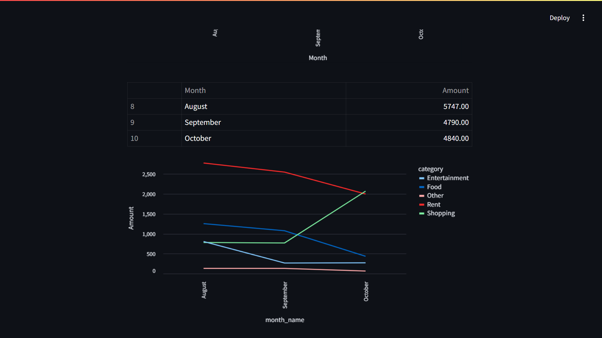
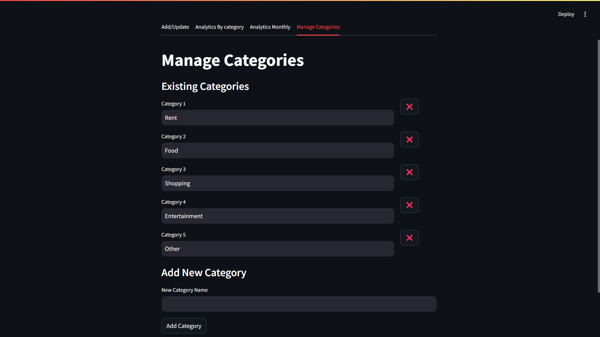

# Expense Management System
This is an Expense management system with streamlit as Frontend , FastAPI as Backend and MySQL as Database.

## Project Structure

- **frontend/**: Contains the Streamlit application code.
- **backend/**: Contains the FastAPI backend server code.
- **tests/**: Contains the test cases for both frontend and backend.
- **requirements.txt**: Lists the required Python packages.
- **README.md**: Provides an overview and instructions for the project.
- **run_app.py** :  Script to create the executable file for the application.

## Setup Instructions

Follow these steps to set up and run the Expense Management System:

### 1. Clone the Repository

Clone the project repository to your local machine:

```bash
git clone https://github.com/chirag-agrawal24/Expense-Tracking-System.git
cd expense-management-system
```

### 2. Install Dependencies

Make sure you have Python installed on your system. Then, install the required dependencies:

```bash
pip install -r requirements.txt
```

### 3. Setup MySQL

- Install MySQL if you haven't already.
- Update the MySQL configuration in the [backend/sql.json](backend/sql.json) file according to your MySQL setup. Ensure the database is created and accessible.

### Running the Application

You can run the application using two methods:

### Method 1: Executable File

#### Run the Application

1. Navigate to the `dist` folder created by PyInstaller.
2. Double-click on `run_app.exe` to launch the application. This eliminates the need to handle opening or closing the app separately.

#### To Recreate the Executable File

If you need to recreate the executable file, follow these steps:

1. Open a command line interface and navigate to the project directory.
2. Run the following command:

   ```bash
   pyinstaller --onefile run_app.py
   ```

3. A new folder named `dist` will be created containing the executable.

### Method 2: Run the FastAPI and Streamlit Apps Separately

1. **Run the FastAPI Server**: 
   Open a command line and execute the following command to start the FastAPI server:

   ```bash
   uvicorn backend.server:app --reload
   ```

   The FastAPI server will start running at `http://127.0.0.1:8000`.

2. **Run the Streamlit App**: 
   Open another command line window and execute:

   ```bash
   streamlit run frontend/app.py
   ```

   This will start the Streamlit app, which can be accessed at `http://localhost:8501`.

## Additional Notes

- Ensure that your MySQL server is running before launching the application.
- For testing, navigate to the `tests/` directory and run the respective test files to ensure everything is functioning correctly.
  

## Screenshots

Below are screenshots showcasing various features of the Expense Management System.

### Add/Update Page & Analytics By Categories

| Add/Update Page                     | Analytics By Categories              |
|-------------------------------------|--------------------------------------|
|  |  |
| *Form for entering new expenses.*   | *Detailed view of expense reports.*  |

### Monthly Analytics and Category Management

| Monthly Analytics Page              | Monthly Analytics Page (Alternative View) |
|-------------------------------------|--------------------------------------|
|  |  |
| *Detailed view of monthly expense reports.*   | *Another perspective of monthly analytics.*  |

| Category Management                  |
|--------------------------------------|
|  |
| *Form for entering new category options.*  |
